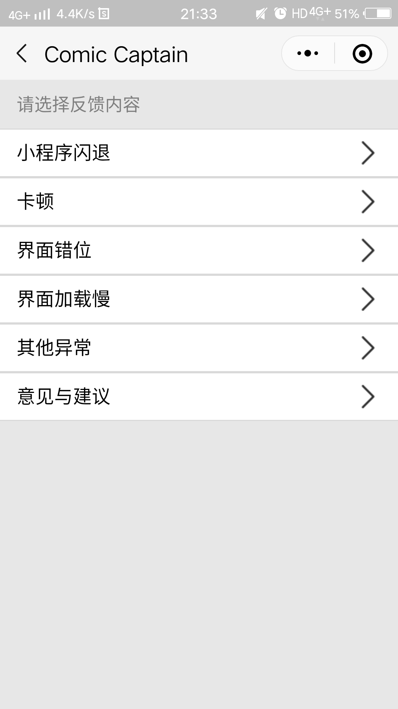

# ComicCaptain
## 漫画阅读微信小程序

#### 主页面

  
  Figure 1. 主页面

#### 分类

  
  Figure 2. 分类界面

 
#### 排行榜
 

  
  Figure 3. 排行榜界面

#### 搜索
 

  
  Figure 4. 搜索界面

#### 漫画内容

  

    
    
Figure 5. 漫画简介

  

  

    
    
Figure 6. 漫画目录

  

  

    
    
Figure 7. 漫画页

  

#### 个人界面   

  

    
    
Figure 8. 我的上传

  

  

    
    

Figure 9. 上传漫画

  

  

    
    
Figure 10. 历史纪录

  

  

    
    
Figure 11. 反馈

  

## 参考文档

- 微信小程序开发者文档：https://developers.weixin.qq.com/miniprogram/dev/wxcloud/basis/getting-started.html
