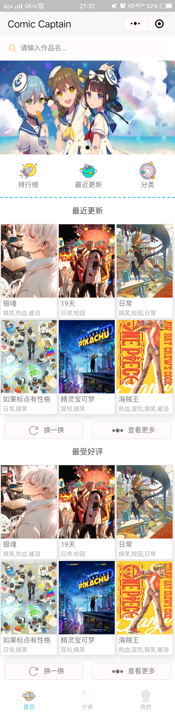
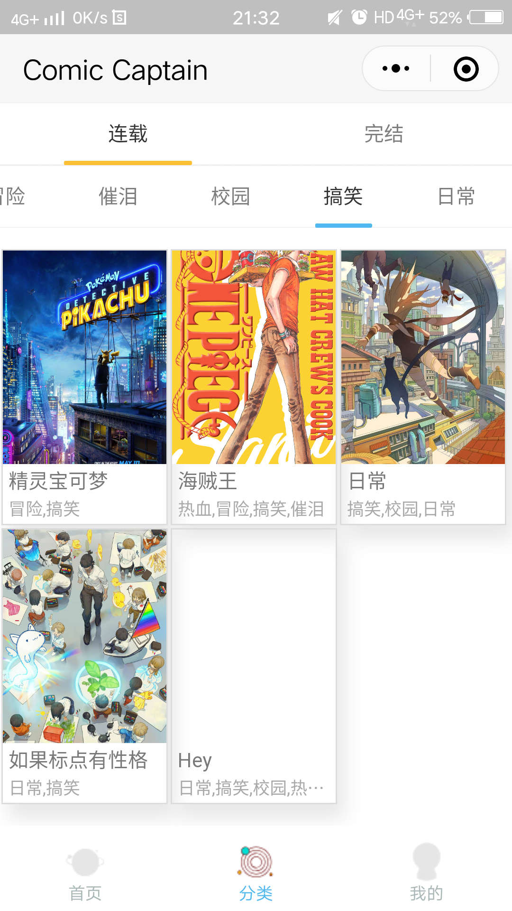
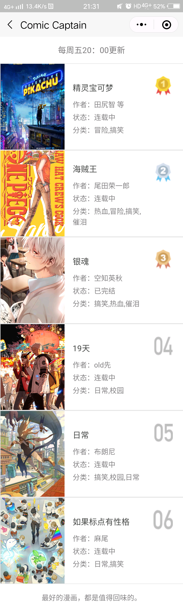
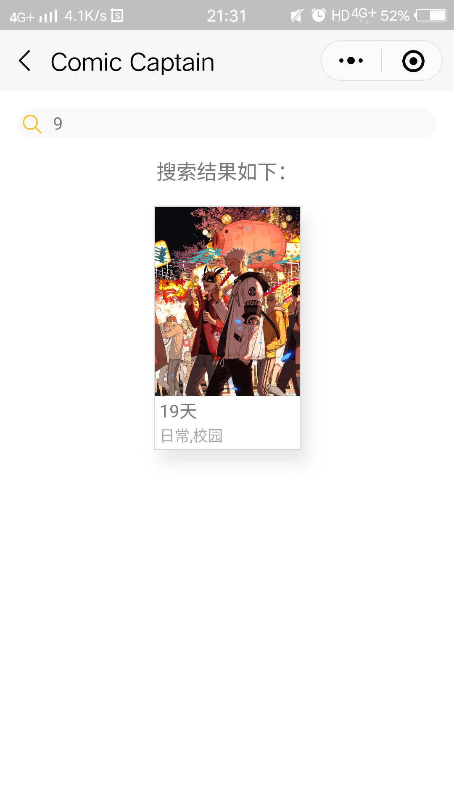
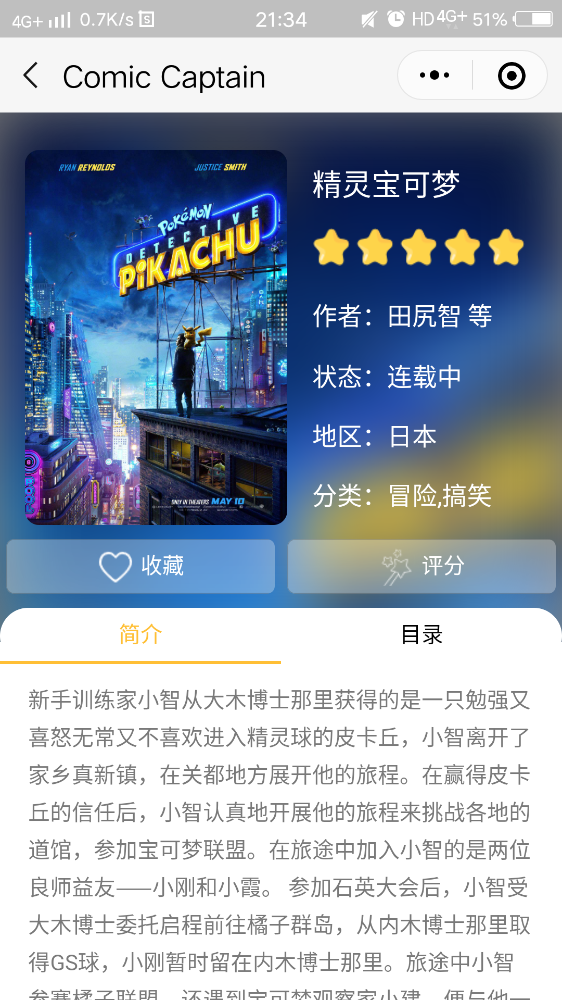
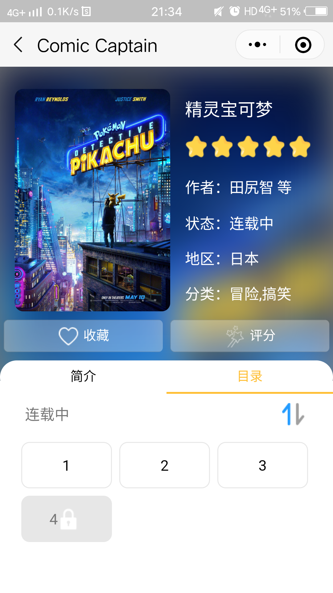
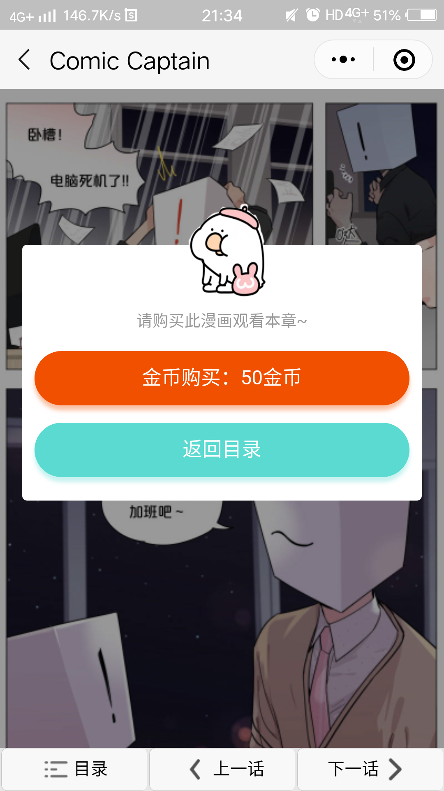
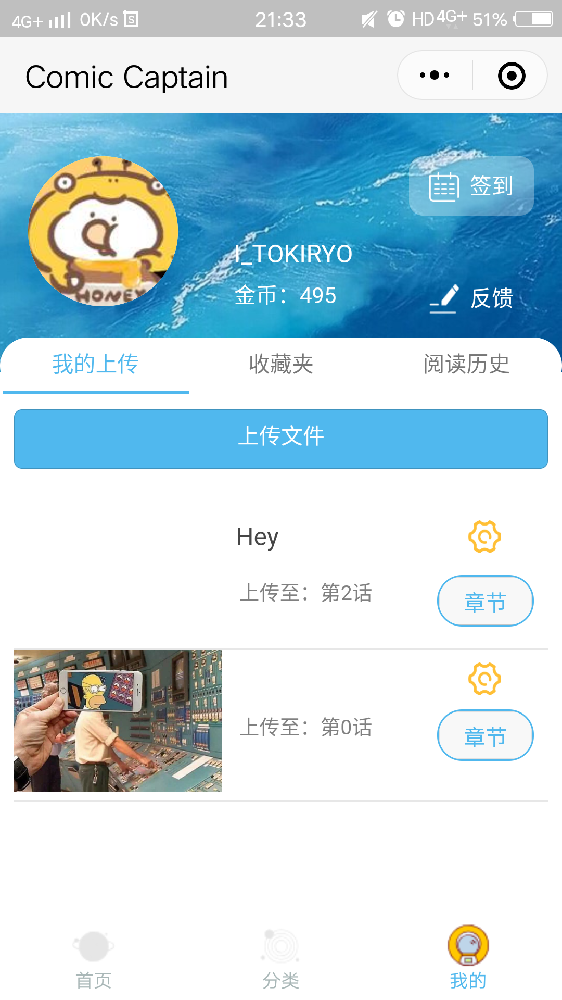
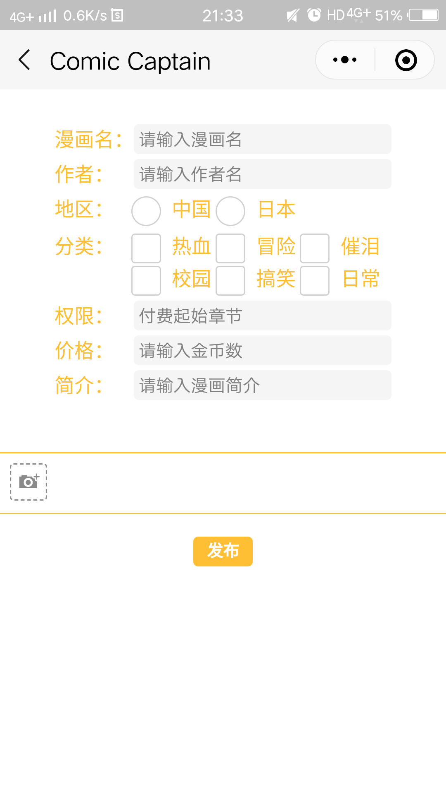
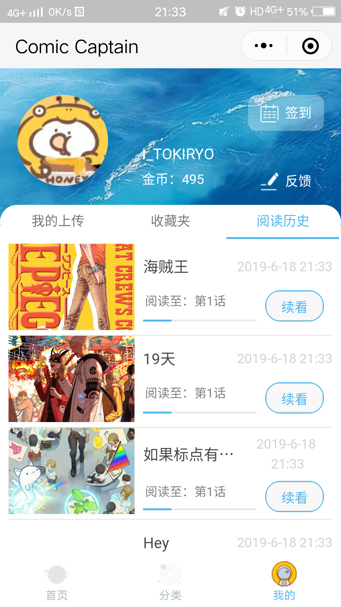

# ComicCaptain
## 漫画阅读微信小程序

#### 主页面

  
  Figure 1. 主页面

#### 分类

  
  Figure 2. 分类界面

 
#### 排行榜
 

  
  Figure 3. 排行榜界面

#### 搜索
 

  
  Figure 4. 搜索界面

#### 漫画内容
在主页面中，点击任意空白区域，即可弹出“新建课程”界面。也在侧滑菜单中，点击“添加”，进入课程添加界面。在“新建课程”界面中，用户可进行单双周的选择以及课程其他信息的输入。输入完毕后，点击“完成”，即完成了一次课程的添加，此时，课程会实时显示在首页课程界面中。若是误触导致进入添加界面，也可通过点下方“X”号退出。
通过ArrayAdapter（数组适配器）与Spinner相结合，在添加课程的布局中实现单双周的下拉列表显示，再结合点击事件，在用户点击“完成”按钮后，若是所有信息输入无误，则这些添加的数据将被传到数据库，再通过putExtra实现AddCourseActivity与MainActivity间的课程信息传递。课程信息传递后，在MainActivity中创建课程表视图，实现新添加的课程信息的实时显示。其中，单个课程布局的高度是根据课程时间差值计算得到。若是信息填写出错或是基本信息未填写完整，通过Toast对用户的不合法信息输入进行提示。

  

    
    
Figure 5. 漫画简介

  

  

    
    
Figure 6. 漫画目录

  

  

    
    
Figure 7. 漫画页

  

#### 个人界面   

  

    
    
Figure 8. 我的上传

  

  

    
    

Figure 9. 上传漫画

  

  

    
    
Figure 10. 历史纪录

  

  

    
    
Figure 11. 反馈

  

## 参考文档

- 微信小程序开发者文档：https://developers.weixin.qq.com/miniprogram/dev/wxcloud/basis/getting-started.html
